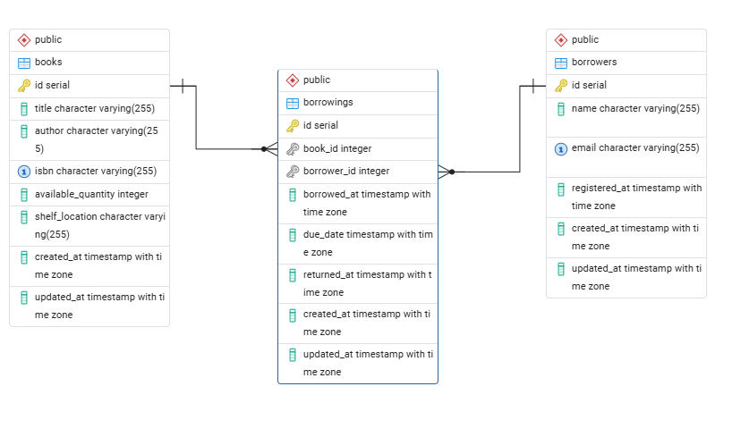

# Library Management System

RESTful API built with Node.js, Express, and PostgreSQL for managing books, borrowers, and borrowing operations.

## Features

- Books CRUD, search, and pagination
- Borrowers CRUD and pagination
- Borrowing checkout/return with database transactions
- Overdue borrowings listing
- Borrowing analytics and export reports (CSV/XLSX)
- Rate limiting applied to reports endpoints due to heavy export/analytics operations
- Unified API response format and centralized error handling

## Tech Stack

- Node.js (CommonJS)
- Express
- PostgreSQL
- Knex (migrations)

## Getting Started

### Prerequisites

- Node.js and npm
- PostgreSQL

### 1) Installation

1. Clone the repository:

```bash
git clone https://github.com/abdallaNasser1432/library-management-system.git
```

2. Move into the project folder:

```bash
cd library-management-system
```

3. Install dependencies:

```bash
npm install
```

4. Create a `.env` file (or copy `.env.example`) and update values:

```
PORT=3000

DB_HOST=localhost
DB_PORT=5432
DB_NAME=library_db
DB_USER=postgres
DB_PASSWORD=your_password
```

### 2) Database Setup

1) Create the database (example):

```sql
CREATE DATABASE library_db;
```

2) Run migrations:

```bash
npm run migrate:latest
```

### 3) Run the Server

Development (watch mode):

```bash
npm run dev
```

Production:

```bash
npm start
```

Server defaults to `http://localhost:3000` (or `PORT` from `.env`).

## API Overview

Base URL: `/api`

### Health Check

- `GET /health`

### Books

- `POST /api/books`
- `GET /api/books?limit=10&offset=0`
- `GET /api/books/search?title=&author=&isbn=&limit=10&offset=0`
- `GET /api/books/:id`
- `PUT /api/books/:id`
- `DELETE /api/books/:id`

Required fields on create:

- `title` (string)
- `author` (string)
- `isbn` (string, unique)
- `shelf_location` (string)
- `available_quantity` (number, optional, defaults to 0, must be >= 0)

### Borrowers

- `POST /api/borrowers`
- `GET /api/borrowers?limit=10&offset=0`
- `GET /api/borrowers/:id`
- `PUT /api/borrowers/:id`
- `DELETE /api/borrowers/:id`

Required fields on create:

- `name` (string)
- `email` (string, unique)

### Borrowings

- `POST /api/borrowings/checkout`
- `POST /api/borrowings/return`
- `GET /api/borrowings/borrowers/:id/active`
- `GET /api/borrowings/overdue`

Required fields:

- Checkout: `book_id`, `borrower_id`, `due_date`
- Return: `borrowing_id`

### Reports

- `GET /api/reports/borrowings/summary?from=&to=`
- `GET /api/reports/borrowings/export?from=&to=&format=json|csv|xlsx`
- `GET /api/reports/borrowings/overdue-last-month/export?format=csv|xlsx`
- `GET /api/reports/borrowings/last-month/export?format=csv|xlsx`

Notes:

- `from` and `to` are required for summary/export and should be valid ISO 8601 dates.
- Default formats:
  - Period export (`/borrowings/export`): `json`
  - Last-month exports (`/borrowings/overdue-last-month/export`, `/borrowings/last-month/export`): `csv`
- CSV/XLSX responses are returned as downloadable files.
- Rate limit: 10 requests per minute per IP for all `/api/reports` endpoints.

### Pagination

List and search endpoints accept:

- `limit` (default 10, max 50)
- `offset` (default 0)

## Performance Optimizations

- Index on `books.title` and `books.author`
- Index on (`borrower_id`, `returned_at`) for active borrowings
- Index on (`due_date`, `returned_at`) for overdue queries
- Pagination on all list endpoints

## Database Diagram



### Response Format

All endpoints return a unified JSON shape:

```json
{
  "success": true,
  "message": "OK",
  "data": {}
}
```

Errors follow:

```json
{
  "success": false,
  "message": "Bad request",
  "errors": []
}
```
